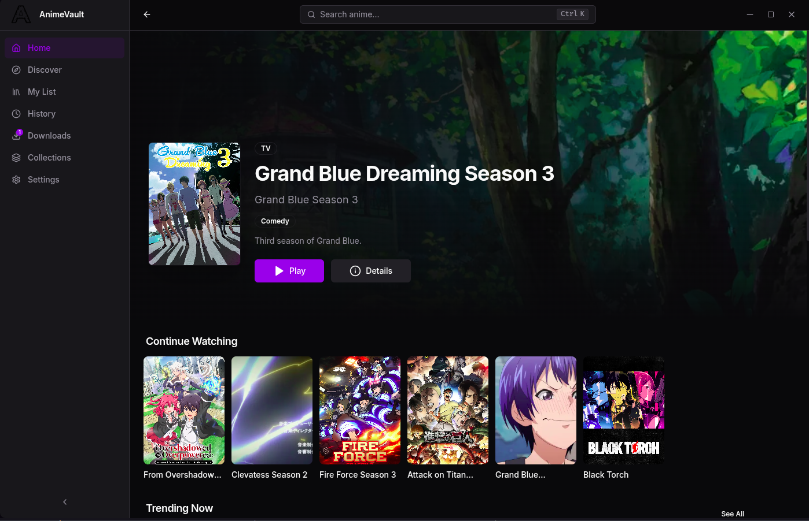

<p align="center">
  
</p>

<h1 align="center">AnimeVault</h1>

<p align="center">
  A cinematic native desktop app for discovering, streaming, and downloading anime — built on Electron, powered by AnimePahe.
</p>

<p align="center">
  <a href="https://github.com/Vlex127/Animevault-releases/releases/latest">
    
  </a>
  
  
</p>

---

## Download

| Format | File | Size |
|--------|------|------|
| `.deb` | [anime_0.4.1_amd64.deb](https://github.com/Vlex127/Animevault-releases/releases/download/v0.4.1/anime_0.4.1_amd64.deb) | ~111 MB |
| `.AppImage` | [AnimeVault-0.4.1.AppImage](https://github.com/Vlex127/Animevault-releases/releases/download/v0.4.1/AnimeVault-0.4.1.AppImage) | ~145 MB |
| `.tar.gz` | [AnimeVault-linux-x64.tar.gz](https://github.com/Vlex127/Animevault-releases/releases/download/v0.4.1/AnimeVault-linux-x64.tar.gz) | ~142 MB |

### Install with one command (no sudo required)

```bash
curl -fSL https://raw.githubusercontent.com/Vlex127/Animevault-releases/main/install.sh | bash
```

To update, re-run the same command.

### Install .deb (Debian / Ubuntu / Kali)

```bash
sudo apt install ./anime_0.4.1_amd64.deb
```

### Run AppImage

```bash
chmod +x AnimeVault-0.4.1.AppImage
./AnimeVault-0.4.1.AppImage
```

### Prerequisite — yt-dlp (for downloads)

```bash
pip install yt-dlp --break-system-packages
```

---

## Features

- **Cinematic Player** — Custom HLS player with quality selection, subtitle/dub switching, auto-skip intro/outro via AniSkip, PiP, and keyboard shortcuts
- **Native Downloads** — Download episodes via yt-dlp with real-time progress, pause/resume, and automatic retry
- **AniList Discovery** — Browse trending, seasonal, and genre-filtered anime with rich metadata and artwork
- **Watch History** — Per-episode progress saved locally. Resume from where you left off
- **Your Library** — Organize anime into My List, Favorites, Watching, Completed, and custom Collections
- **AnimePahe Stream** — Direct HLS streaming with 360p, 720p, and 1080p quality options
- **Auto-Updates** — SHA-256 verified in-app updates for tarball installs; re-run install.sh to update any format

---

## Support

If you enjoy AnimeVault, consider supporting the project:

[](https://coffee.vincentiwuno.me/)

---

## Source Code

The source code for this application is private. For issues and feature requests, please [open an issue](https://github.com/Vlex127/Animevault-releases/issues).

---

## License

MIT
